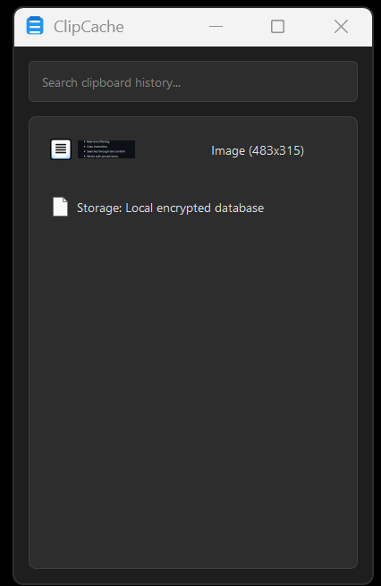

# ClipCache

A powerful clipboard manager for Windows that securely stores and manages your clipboard history.



## Features

- 📋 **Clipboard History**: Automatically saves text and images from your clipboard
- 🔒 **Secure Storage**: All clipboard data is stored securely in an encrypted database
- 📌 **Pin Important Items**: Keep frequently used items in your history
- 🔍 **Search Functionality**: Quickly find items in your clipboard history
- 🎨 **Customizable Themes**: Light and dark mode support
- ⚡ **Auto-Clear**: Automatically remove old items based on your preferences
- 🔔 **System Tray Integration**: Easy access from your system tray
- 🖼️ **Image Support**: Full support for both text and image clipboard items

## Data Storage

ClipCache stores all data locally in an encrypted database in your user directory (`~/.clipcache/`). The application:
- Never sends data to external servers
- Encrypts all stored content
- Automatically detects and flags sensitive information
- Allows you to pin important items
- Provides automatic cleanup of old items

## Installation

1. Clone the repository:
```bash
git clone https://github.com/JudeLabs/ClipCache.git
cd ClipCache
```

2. Install the required dependencies:
```bash
pip install -r requirements.txt
```

3. Run the application:
```bash
python clipcache.py
```

## Usage

- **System Tray Icon**: Right-click to access the main menu
- **History Window**: View and manage your clipboard history
- **Search**: Use the search bar to find specific items
- **Context Menu**: Right-click items for additional options
- **Pin Items**: Keep important items in your history
- **Settings**: Customize the application behavior

## Settings

- **Theme**: Choose between light and dark mode
- **History Size**: Set the maximum number of items to store
- **Auto-Clear**: Configure automatic removal of old items
- **Window Behavior**: Control window positioning and visibility

## Security

- All data is stored locally in an encrypted database
- Sensitive data detection (emails, credit cards, etc.)
- Secure file permissions
- No internet connectivity required
- No data sharing or telemetry

## License

This project is licensed under the MIT License - see the [LICENSE](LICENSE) file for details.

## Dependencies

- PyQt5
- SQLite3
- PIL (Python Imaging Library)
- pywin32

## Contributing

Contributions are welcome! Please feel free to submit a Pull Request.

## Support

If you encounter any issues or have questions, please open an issue on GitHub. 